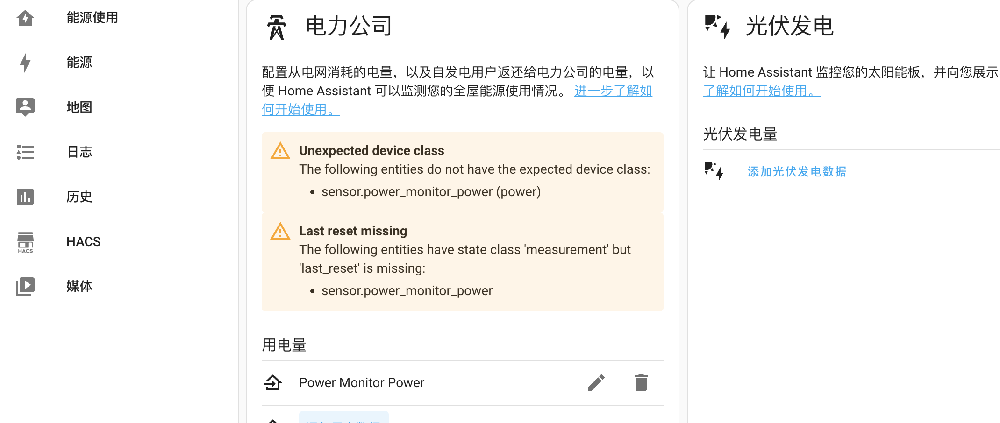

# 使用培正 PZEM-004T 和 HomeAssistant 监测家庭用电情况

培正 PZEM-004T 是一个电能监控模块，能够监测家庭用电的电压，电流，频率，实时功率，耗电量等信息；支持通过 UART 协议进行读取；因此可以使用 ESP8266 或者 ESP32 等模块，将用电信息添加到 HomeAssistant 中


##1.  ESP-01S 刷入 esphome 固件

### 运行 esphome 容器

```bash
docker run -d \
 --name="esphome" \
 -p 6052:6052 \
 -e TZ=Asia/Shanghai \
 --hostname="esphome" \
 -v ~/esphome/config:/config \
 --privileged \
 esphome/esphome
```

### 刷入固件

启动后访问 [http://localhost:6052/](http://localhost:6052/)，选择添加设备，完整配置文件如下：

```yaml
substitutions:
  name: "power-monitor"
  friendly_name: "Power Monitor"
  
esphome:
  name: ${name}
  project:
    name: "power.monitor"
    version: "1.0.0"


esp8266:
  board: esp01_1m # ESP-01/01S

logger:
  baud_rate: 0 # 和 UART 冲突，关闭日志

# 启用 Home Assistant API
api:

# 手动升级密码
ota:
  password: "12345678"

wifi:
  ssid: !secret wifi_ssid
  password: !secret wifi_password

  # WiFi 连接失败时启用 AP 
  ap:
    ssid: ${name}
    password: "12345678"

captive_portal:
web_server:
      port: 80
  
status_led:
  pin: GPIO2

# ESP 01/01S 的引脚为 GPIO1 和 GPIO3
uart:
  rx_pin:
    number: GPIO3 
  tx_pin: 
    number: GPIO1 
  baud_rate: 9600
  id: mod_uart

modbus:
  send_wait_time: 50ms
  uart_id: mod_uart
  id: mod_bus

text_sensor:

- platform: version
  name: "${friendly_name} Version"
  hide_timestamp: false  
  
sensor:
- platform: pzemac
  current: # 电流
    name: '${friendly_name} Current'
  voltage: # 电压
    name: '${friendly_name} Voltage'
  energy: # 总电量
    name: '${friendly_name} Energy'
    # 转换成 kWh
    filters:
      - multiply: 0.001
    unit_of_measurement: 'kWh'
    # 保留小数点后三位
    accuracy_decimals: 3
  power: # 当前功率
    name: '${friendly_name} Power'
    filters:
      - multiply: 1
    unit_of_measurement: 'Wh'
    accuracy_decimals: 1
  frequency: # 频率
    name: '${friendly_name} Frequency'
  power_factor: # 功率因子
    name: '${friendly_name} Power Factor'
  update_interval: 15s  # 15s 同步一次，太短可能会导致 ESP 不断重启

# 启动时间
- platform: uptime
  name: "${friendly_name} Uptime"
  id: uptime_sensor
  update_interval: 1s
```

将 ESP-01S 连接到电脑，然后刷入即可

## 2. 连接培正电表 

接线方式如图：


连接好之后将互感线圈挂到入户线或需要测量的电线上，然后通电启动；待启动成功后访问 [http://power-monitor.local/](http://power-monitor.local/)(和 esphome 配置中的 `substitutions.name`一致) 即可看到相关的数据


## 3. 配置 Home Assistant 

在 Home Assistant 添加 ESPHome 组件，将 power-monitor 添加到实体中


### 配置能源面板 

进入 HomeAssistant-配置-仪表盘-能源，添加用电数据，实体选择 `Power Monitor Energy`


添加后提示 `Unexpected device class` 和 `Last reset missing` 错误



因为 ESPHome 传感器没有提供 Home Assistant 需要的重置时间和传感器类型，当配置为能源时，会提示 `Last reset missing` 和 `Unexpected device class` 错误；需要在配置文件 `configuration.yaml` 中为其指定类型和重置时间

```yaml
homeassistant:
  customize_glob:
    sensor.power_monitor_power:
      last_reset: '1970-01-01T00:00:00+00:00'
      device_class: energy
      state_class: measurement
```

重启后即可看到用电信息：

